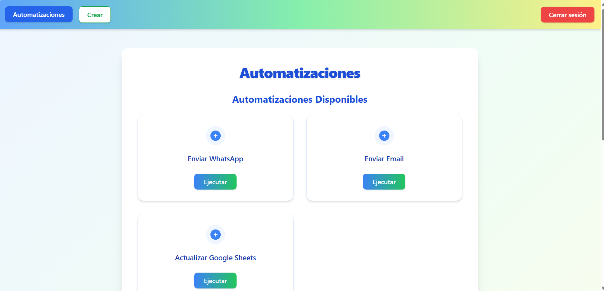

# Automatizaciones para Empresa

Automatizaciones para Empresa es una plataforma moderna y visual para crear, ejecutar y gestionar automatizaciones de negocio de manera sencilla, profesional y eficiente.

## 🚀 ¿Qué puedes hacer con esta app?
- **Ejecutar automatizaciones predefinidas** (WhatsApp, Email, Google Sheets, etc.) de forma guiada y paso a paso.
- **Crear tus propias automatizaciones** personalizadas, eligiendo tipo, parámetros y nombre.
- **Gestionar y ejecutar tus automatizaciones** desde un panel visual, con feedback en tiempo real.
- **Visualizar y elegir entre automatizaciones disponibles** con un solo clic.
- **Interfaz moderna, responsiva y atractiva** con experiencia tipo wizard.

## 🛠️ Tecnologías utilizadas
- **Frontend:** React 18, React Router v6, Tailwind CSS, Heroicons
- **Backend:** Node.js, Express, MySQL (mysql2/promise)
- **Autenticación:** JWT
- **Integraciones:** WhatsApp, Email, Google Sheets (simulado/demo)

## 📂 Estructura principal
- `/frontend-nuevo`: Aplicación React (UI, wizard, paneles)
- `/backend`: API REST Node.js/Express (automatizaciones, ejecución, usuarios)

## ⚙️ Funcionalidades principales
- Panel de automatizaciones disponibles (tarjetas visuales, botón ejecutar)
- Wizard paso a paso para crear automatizaciones propias
- Ejecución guiada de automatizaciones predefinidas (sin guardar)
- Gestión de automatizaciones creadas (ejecutar, eliminar, ver logs)
- Autenticación de usuarios
- API RESTful documentada y extensible

## 🖼️ Vista inicial
Coloca aquí una imagen llamada `vistainicial.png` mostrando el dashboard principal de la app.

## 📝 Instalación y uso rápido
1. Clona el repo: `git clone https://github.com/DanielCostella/AutomatizacionesParaEmpresa.git`
2. Instala dependencias en ambos folders:
   - `cd backend && npm install`
   - `cd ../frontend-nuevo && npm install`
3. Configura tus archivos `.env` en ambos folders (ver `.env.example` si existe)
4. Inicia backend: `npm run dev` (en `/backend`)
5. Inicia frontend: `npm start` (en `/frontend-nuevo`)
6. Accede a `http://localhost:3000` y ¡listo!

## 📄 Licencia
MIT

---

> Desarrollado por Daniel Costella y colaboradores. ¡Contribuciones y estrellas bienvenidas!
